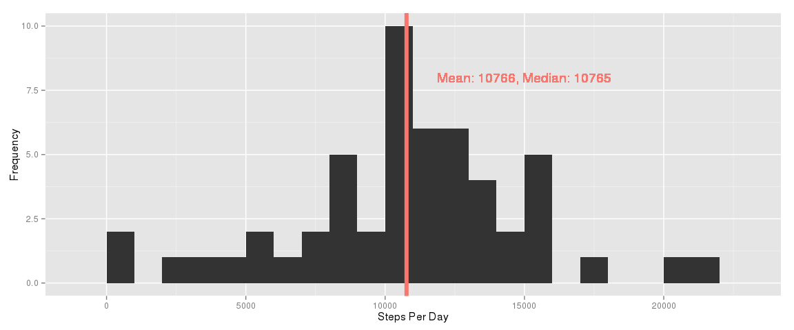
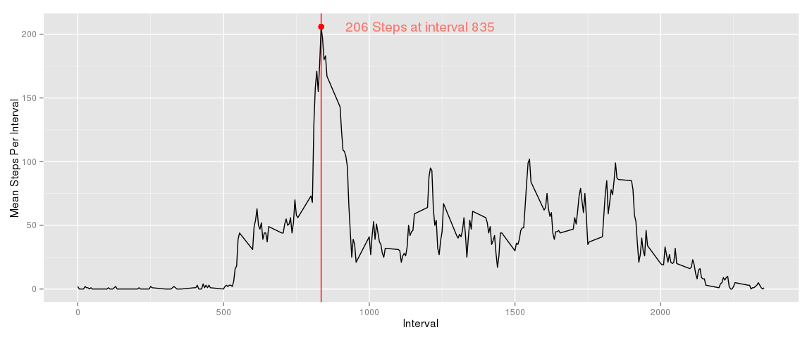
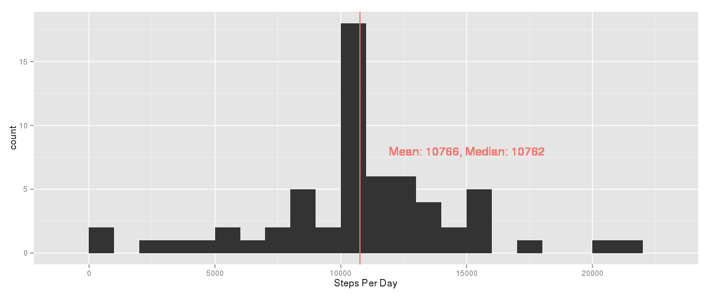
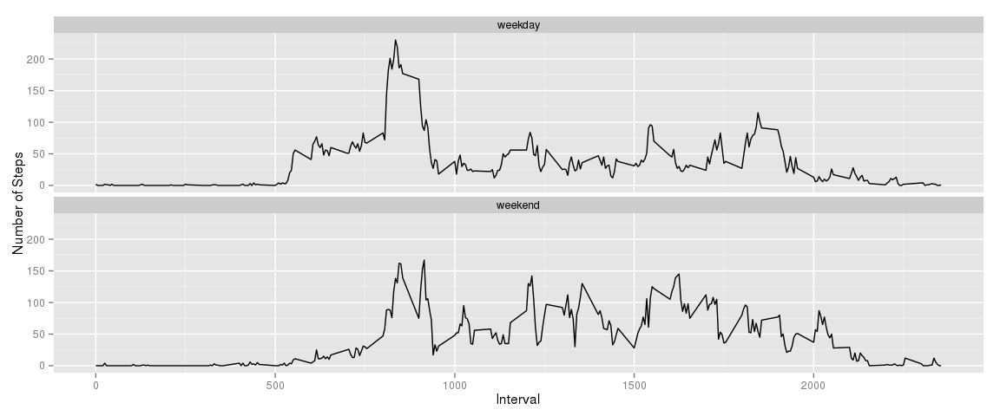

# Reproducible Research: Peer Assessment 1
# About the data
Fields:

    * steps: Steps taking in 5-minute intervals (NA's represent)

    * date: Date of the interval measurement, format: YYYY-MM-DD

    * interval: Identifier for the 5-minute intervals

There are 17,568 observations in this dataset.

# Loading and preprocessing the data.

```r
library(knitr)
library(ggplot2)
library(dplyr)
```

```
## 
## Attaching package: 'dplyr'
## 
## The following object is masked from 'package:stats':
## 
##     filter
## 
## The following objects are masked from 'package:base':
## 
##     intersect, setdiff, setequal, union
```

```r
steps <- read.csv("repdata_data_activity/activity.csv")
```

# Mean total number of steps taken per day.

## Prep date

```r
steps$date <- as.Date(steps$date)
steps.by_date <- group_by(steps, date)
```
## Remove na's and sum per day

```r
steps.by_date <- na.omit(steps.by_date)
steps.by_date.sums <- steps.by_date %>% summarise_each(funs(sum))
```

## Clean up names and date

```r
names(steps.by_date.sums) <- c("date", "steps")
steps.by_date.sums$date <- as.Date(steps.by_date.sums$date)
```

## Get mean and median

```r
steps.by_date.sums.mean_median <- data.frame(Val = c(round(mean(steps.by_date.sums$steps))
                                                    ,median(steps.by_date.sums$steps))
                                            , Calculation = c("Mean","Median"))
m_m <- steps.by_date.sums.mean_median
```

## Plot1

```r
p1 <- ggplot(data = steps.by_date.sums[,1:2], aes(x = steps.by_date.sums$steps)) +
    geom_text(aes(x = 15000, y = 8, label = paste0("Mean: ", m_m[1,1], ", Median: ", m_m[2,1]), color = "red"), show_guide=FALSE) +
    geom_histogram(binwidth=1000) + xlab("Steps Per Day") +
    geom_vline(data = steps.by_date.sums.mean_median, aes(xintercept = Val, color = "red"), show_guide = FALSE, size = 2) +
ylab("Frequency")
p1
```

 

# Average daily activity pattern

## Group by intervals

```r
steps.by_interval <- group_by(steps, interval)
```

## Remove na's and get mean per interval

```r
steps.by_interval <- na.omit(steps.by_interval)
steps.by_interval.means <- steps.by_interval %>% summarise_each(funs(mean))
steps.by_interval.means$steps <- round(steps.by_interval.means$steps)
```

## Get max point for interval with highest average steps

```r
x_y <- steps.by_interval.means[steps.by_interval.means[,2]==max(steps.by_interval.means$steps),][,1:2]
```

## Plot2

```r
p2 <- ggplot() +   geom_vline(xintercept = x_y$interval, color = "red") +
    geom_text(aes(x = 1175, y = 206, label = paste0(x_y$steps, " Steps at interval ", x_y$interval), color = "red"), show_guide=FALSE) +
    geom_line(data = steps.by_interval.means, aes(x = interval, y = steps)) +
    xlab("Interval") + ylab("Mean Steps Per Interval") +
    geom_point(aes(x_y$interval, x_y$steps), size = 3, color = "red")
p2
```

 

# Impute missing values

## Get location and count of NA's

```r
steps.na_id <- is.na(steps$steps)
steps.na_cnt <- sum(steps.na_id)
steps.imputed <- steps
steps.imputed[steps.na_id & steps.imputed$interval == steps.by_interval.means$interval,]$steps <- steps.by_interval.means$steps
```

## Group by date

```r
steps.imputed.by_date <- group_by(steps.imputed, date)
```

## Remove na's and sum per day

```r
steps.imputed.by_date <- na.omit(steps.imputed.by_date)
steps.imputed.by_date.sums <- steps.imputed.by_date %>% summarise_each(funs(sum))
```

## Clean up names and date

```r
names(steps.imputed.by_date.sums) <- c("date", "steps")
steps.imputed.by_date.sums$date <- as.Date(steps.imputed.by_date.sums$date)
```

## Get mean and median

```r
steps.imputed.by_date.sums.mean_median <- data.frame(Val = c(round(mean(steps.imputed.by_date.sums$steps))
                                                     ,median(steps.imputed.by_date.sums$steps))
                                             , Calculation = c("Mean","Median"))
m_m <- steps.imputed.by_date.sums.mean_median
```

## Plot3

```r
p3 <- ggplot(data = steps.imputed.by_date.sums[,1:2], aes(x = steps.imputed.by_date.sums$steps)) +
    geom_histogram(binwidth=1000) + xlab("Steps Per Day") +
    geom_text(aes(x = 15000, y = 8, label = paste0("Mean: ", m_m[1,1], ", Median: ", m_m[2,1]), color = "red"), show_guide=FALSE) +
    geom_vline(data = steps.imputed.by_date.sums.mean_median, aes(xintercept = Val, color = "red"), show_guide = FALSE)
p3
```

 

####<font color=red> Note: Mean and median not significantly effected by imputing data compared to Plot1</font>

# Activity patterns between weekdays and weekends

## Prep new field for weekday/weekend values and assign to imputed dataset

```r
day_type <- ifelse(weekdays(steps.imputed$date) %in% c("Saturday", "Sunday"), "weekend", "weekday")
steps.imputed <- cbind(steps.imputed, day_type)
```

## Group by intervals

```r
steps.imputed.by_interval <- group_by(steps.imputed, interval, day_type)
```

## Get mean per interval

```r
steps.imputed.by_interval.means <- steps.imputed.by_interval %>% summarise_each(funs(mean))
steps.imputed.by_interval.means$steps <- round(steps.imputed.by_interval.means$steps)
```

## Plot4

```r
p4 <- ggplot() + 
    geom_line(data = steps.imputed.by_interval.means, aes(x = interval, y = steps)) +
    facet_wrap(~ day_type, ncol = 1) +
    xlab("Interval") + ylab("Number of Steps")
p4
```

 


